# WebGPU Rust Architecture Renderer

A 3D architectural visualization system built with Rust and WebGPU that can render buildings, rooms, and architectural elements from JSON scene descriptions.

## Features

- 🏗️ **Composable Primitives**: Build complex scenes using simple primitives (walls, doors, windows, furniture, etc.)
- 📄 **JSON Scene Format**: Define scenes declaratively in JSON
- 🎮 **Native & Web Support**: Runs both as a native application and in the browser via WASM
- 🎨 **3D Rendering**: Full 3D geometry with proper normals and texture coordinates
- 📐 **Architectural Elements**: Walls, windows, doors, floors, ceilings, stairs, columns, and furniture
- 📸 **Screenshot System**: Capture views with camera position embedded in filename for reproducible shots
- 📏 **Measurement Grid**: Visual grid system with 1m/5m markings and axis indicators

## Quick Start

### Native Build
```bash
# Clone the repository
git clone https://github.com/miguelemosreverte/architecture-rust-webgpu
cd architecture-rust-webgpu

# Build and run
cargo build --release

# Run with default scene (simple room)
cargo run

# Run with specific example by number
cargo run -- 7              # Loads example 7 (multi-level building)
cargo run -- 10             # Loads example 10 (full house)

# Run with specific JSON file
cargo run -- examples/5_two_rooms.json
cargo run -- my_custom_scene.json

# Run with example name (without number prefix)
cargo run -- room_with_furniture

# Reproduce camera position from screenshot
cargo run -- --screenshot screenshot_pos_1.00_2.00_3.00_rot_45.00_30.00.png
```

### Interactive Controls

While the application is running:

**Camera Movement:**
- `W` - Move forward
- `S` - Move backward
- `A` - Move left
- `D` - Move right
- `Space` - Move up
- `Shift` - Move down
- Mouse movement - Look around (FPS style)
- `P` - Take screenshot (saves to screenshots/ folder with timestamp)

**Scene Selection:**
- Press `1` through `9` for examples 1-9
- Press `0` for example 10

## Gallery

### Example Scenes

The renderer includes 10 example scenes demonstrating various architectural elements and complexity levels:

#### Basic Elements (Examples 1-3)
<table>
<tr>
<td align="center">
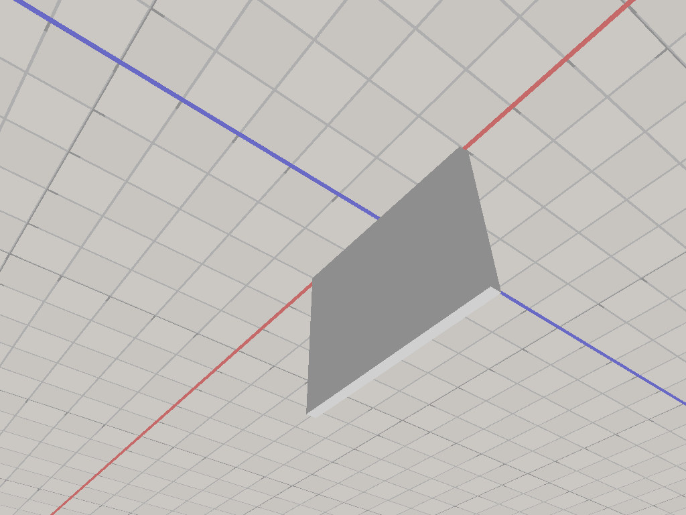<br>
<b>01: Single Wall</b><br>
Basic wall primitive
</td>
<td align="center">
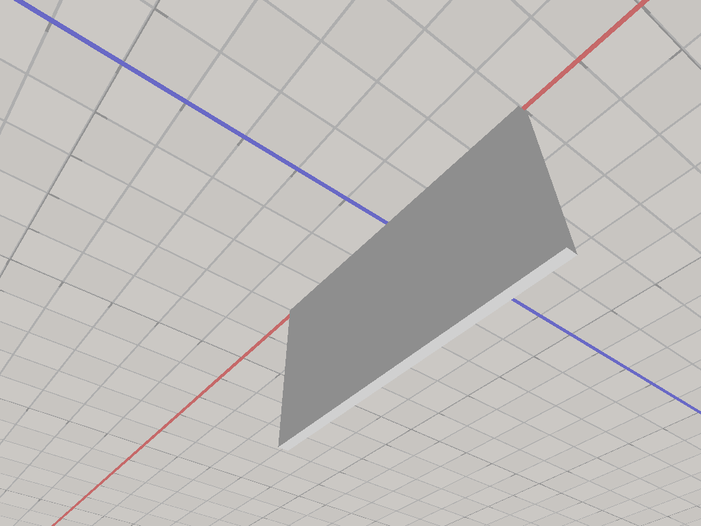<br>
<b>02: Wall with Window</b><br>
Wall with window cutout
</td>
<td align="center">
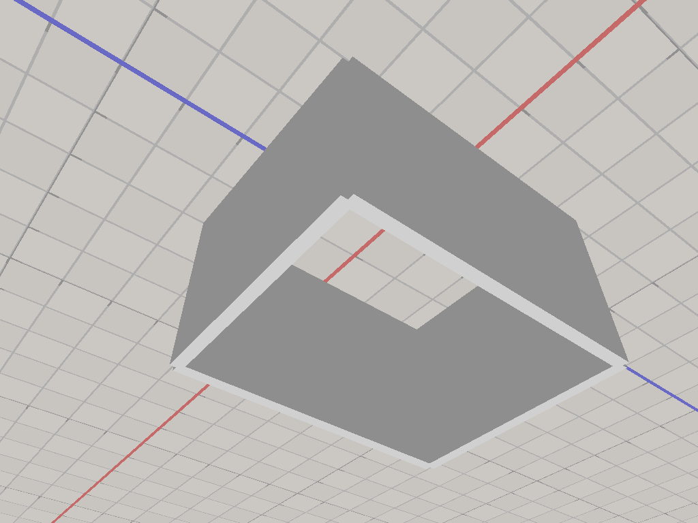<br>
<b>03: Simple Room</b><br>
Four walls forming a room
</td>
</tr>
</table>

#### Room Features (Examples 4-6)
<table>
<tr>
<td align="center">
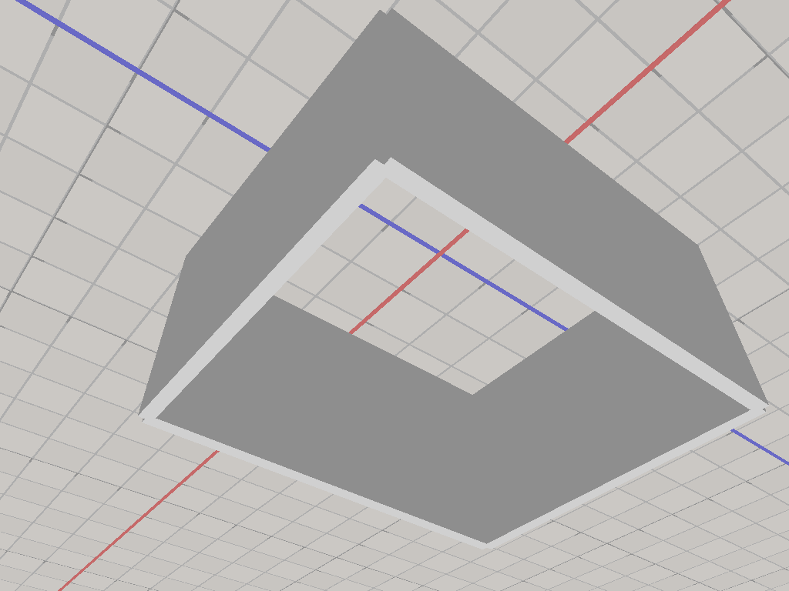<br>
<b>04: Room with Door & Window</b><br>
Room with openings
</td>
<td align="center">
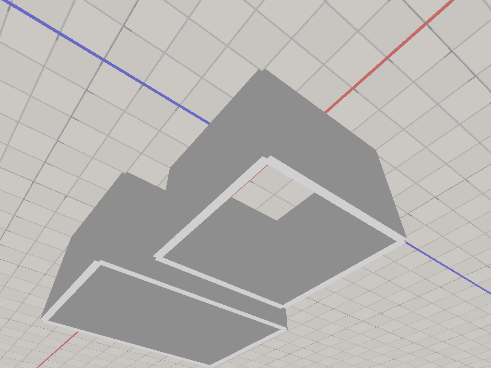<br>
<b>05: Two Rooms</b><br>
Connected room layout
</td>
<td align="center">
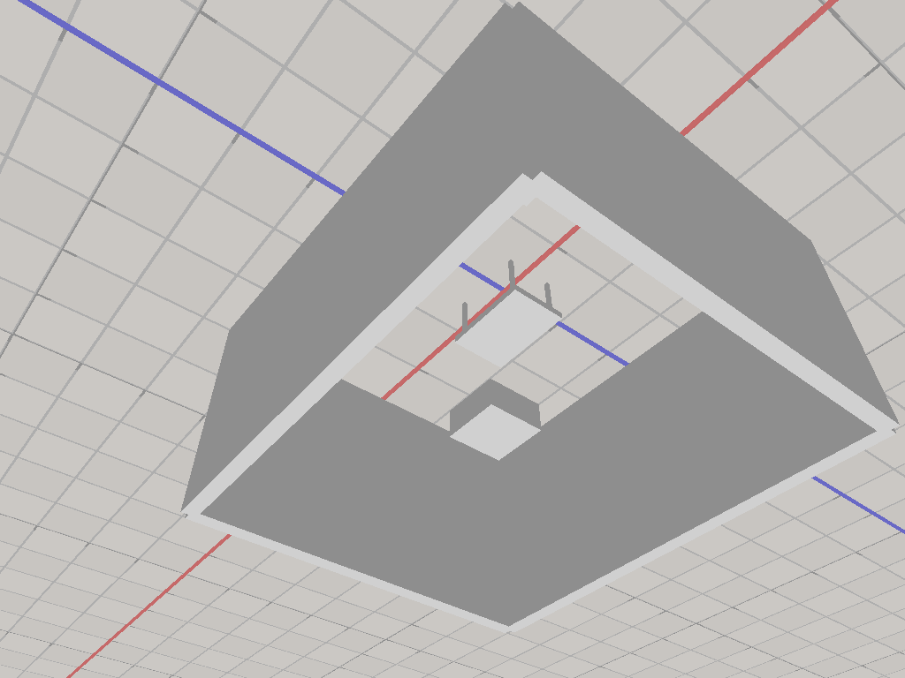<br>
<b>06: Furnished Room</b><br>
Room with furniture
</td>
</tr>
</table>

#### Complex Structures (Examples 7-10)
<table>
<tr>
<td align="center">
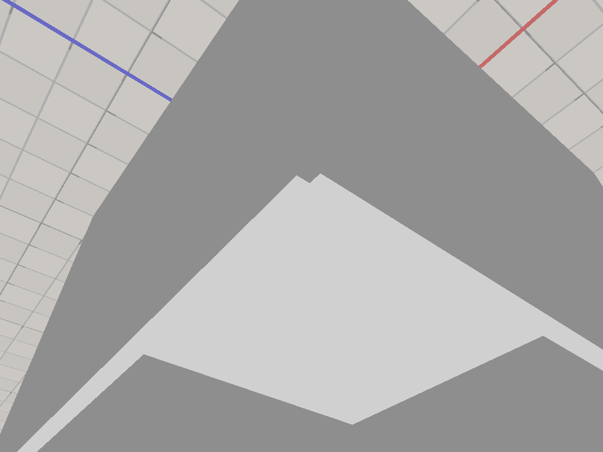<br>
<b>07: Multi-Level</b><br>
Two-story with stairs
</td>
<td align="center">
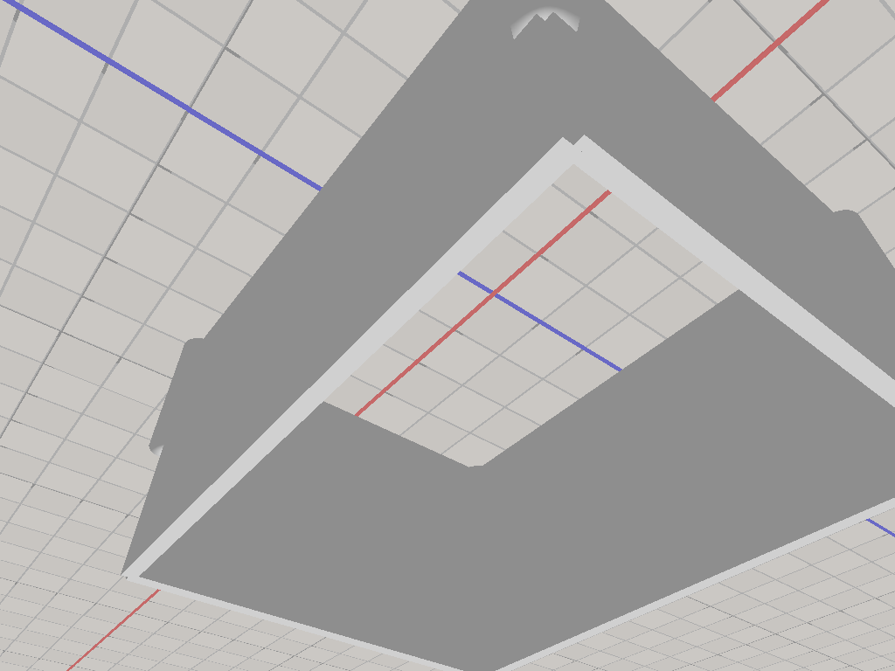<br>
<b>08: Building with Columns</b><br>
Architectural columns
</td>
</tr>
<tr>
<td align="center">
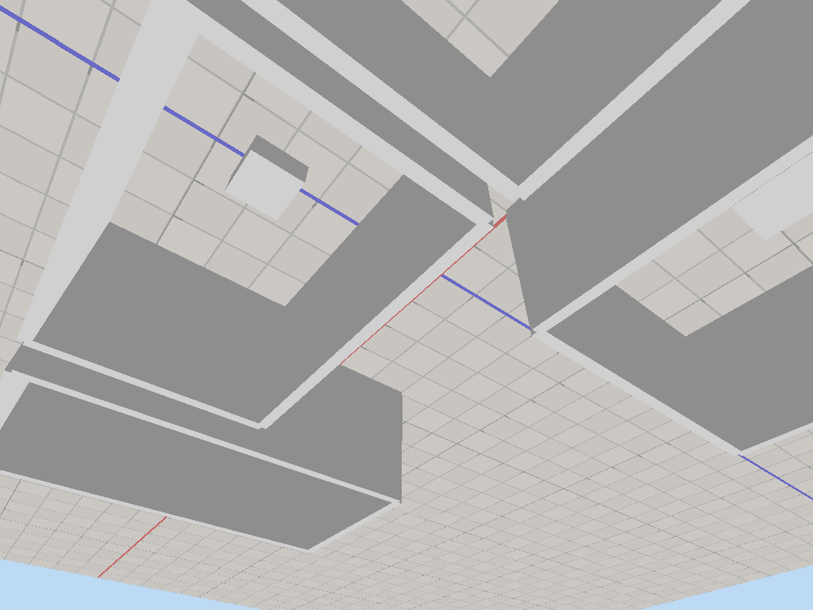<br>
<b>09: Complex Floor Plan</b><br>
Multiple connected rooms
</td>
<td align="center">
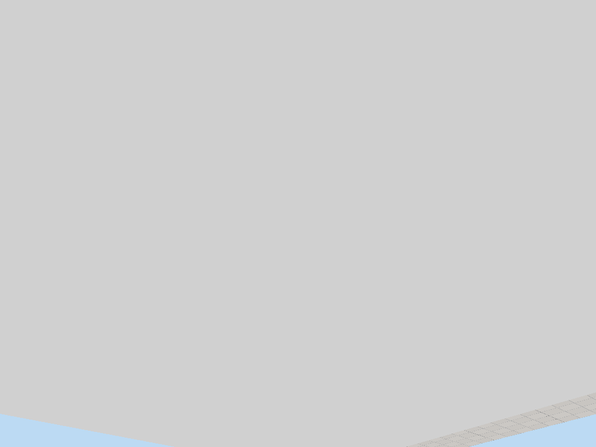<br>
<b>10: Full House</b><br>
Complete house layout
</td>
</tr>
</table>

### Test Scene
<table>
<tr>
<td align="center">
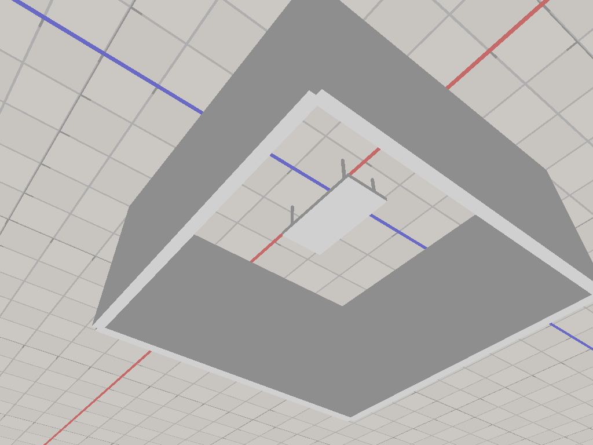<br>
<b>Test Room with Table</b><br>
Simple room with a table in the center, showing furniture rendering
</td>
</tr>
</table>

## Architecture

See [CLAUDE.md](CLAUDE.md) for detailed architecture documentation.

## JSON Scene Format

```json
{
  "name": "Scene Name",
  "camera": {
    "position": [x, y, z],
    "target": [x, y, z],
    "fov": 45.0
  },
  "elements": [
    {
      "type": "room",
      "position": [0.0, 0.0, 0.0],
      "dimensions": {
        "width": 4.0,
        "height": 3.0,
        "depth": 5.0
      },
      "walls": [...]
    }
  ]
}
```

## Current State

### What's Working
- ✅ **Core Rendering**: WebGPU-based 3D rendering pipeline with proper depth testing
- ✅ **Camera System**: FPS-style camera with WASD movement and mouse look
- ✅ **Scene Loading**: JSON-based scene format with support for various architectural elements
- ✅ **Primitives**: Walls, rooms, floors, furniture (tables), columns, stairs
- ✅ **Grid System**: Ground-level measurement grid with 1m/5m markings and axis indicators
- ✅ **Screenshot System**: Capture with embedded camera position for reproducible views
- ✅ **Multi-Scene Support**: Hot-swapping between scenes with number keys

### Recent Improvements
- Fixed floor visibility (winding order correction)
- Fixed inverted A/D controls
- Fixed cylinder rendering (now shows exterior faces)
- Added screenshot reproduction via command-line
- Improved default camera angles for interior views
- Successfully rendering furniture elements

### Known Limitations
- Windows and doors are defined in JSON but not yet rendered as cutouts
- No texture support yet (solid colors only)
- No lighting system (flat shading)
- Web/WASM build not yet configured

## Future Development

- [ ] WASM build configuration
- [ ] Window and door cutouts in walls
- [ ] Texture mapping support
- [ ] Lighting and shadows
- [ ] Scene editor UI
- [ ] More furniture types (chairs, beds, etc.)
- [ ] Curved walls and custom shapes
- [ ] Material properties (glass, metal, wood)
- [ ] Export to common 3D formats

## License

MIT